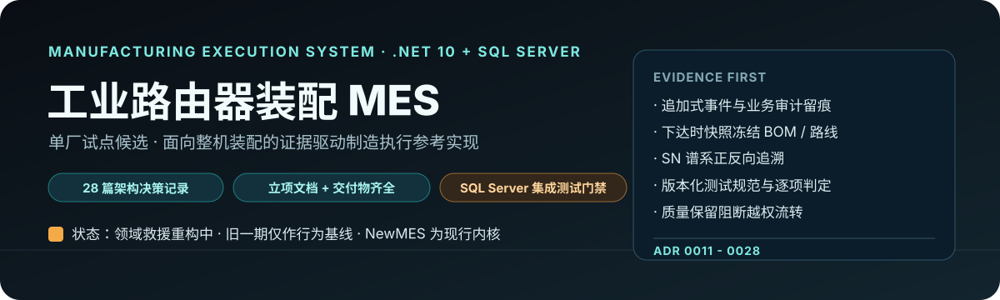
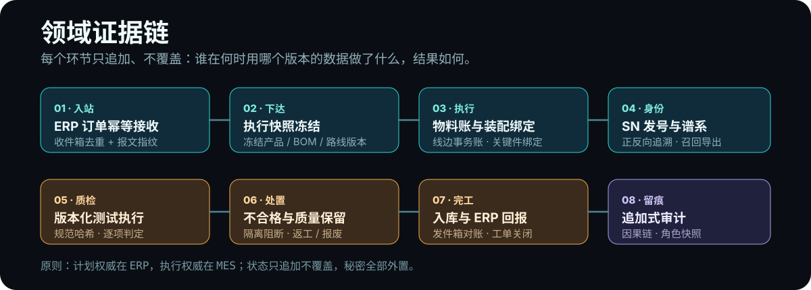

<p align="center">
  
</p>

<p align="center">
  <a href="#这是什么">这是什么</a> ·
  <a href="#领域证据链">领域证据链</a> ·
  <a href="#仓库结构">仓库结构</a> ·
  <a href="#快速开始">快速开始</a> ·
  <a href="#票进度">票进度</a>
</p>

> **状态：领域救援重构中，尚未达到试点验收。** 旧一期曾完成演示级技术验证，但其业务模型已被 2026-07-29 的救援决策重新评估；现有代码和测试只作为旧行为基线，不代表制造从业者评审或真实现场验证。

## 这是什么

面向单厂工业路由器整机装配的制造执行参考实现（单厂试点候选）。计划权威在 ERP，执行权威在 MES；系统以"证据优先"推进——每个制造动作留下可追溯、不可覆盖的记录。

- 领域词汇：[`CONTEXT.md`](./CONTEXT.md)
- 架构决策：[`docs/adr/`](./docs/adr/)（0011-0028 覆盖救援决策、追溯优先、幂等入站、安全基线等）
- 公开证据研究：[`docs/research/industrial-router-assembly-traceability.md`](./docs/research/industrial-router-assembly-traceability.md)

## 领域证据链

<p align="center">
  
</p>

## 仓库结构

| 路径 | 说明 |
| --- | --- |
| `NewMES/` | **救援内核（现行开发）**：独立解决方案，领域 / 基础设施 / API / DbMigrator 分层，含真实 SQL Server 集成测试（`Mes.SqlServer.IntegrationTests`）。详见 [`NewMES/README.md`](./NewMES/README.md) |
| `src/` | 旧一期技术验证（演示级），仅作旧行为基线保留，不再扩展 |
| `web/` | Vue 3 计划端 / 过站台前端（旧一期骨架） |
| `docs/` | ADR 0011-0028、项目立项文档、公开证据研究 |
| `deliverables/` | 立项交付物：立项书 / 解决方案蓝图 / 实施验收方案 / 管理台账 / 方案汇报 |

## 快速开始

### 环境

- 后端：ASP.NET Core（**.NET 10**）+ SQL Server（开发可用 LocalDB）
- 前端：Vue 3 + Vue Router
- 交付：`docker-compose.yml`（需 Docker 守护进程）

### API（无 Docker，旧基线路径）

```powershell
sqllocaldb start MSSQLLocalDB
dotnet run --project src/Mes.Api -- database migrate
dotnet run --project src/Mes.Api -- database seed-demo
dotnet run --project src/Mes.Api
# http://localhost:5101
# 或: pwsh -File scripts/run-api.ps1
```

`database migrate` 是唯一数据库结构演进入口；`database seed-demo` 仅在非 Production 环境显式装载演示账号、主数据和线边库存。API 普通启动只校验 Migration 兼容性，不建库、不升级、不补种。

健康检查：`GET /health`

**若感觉「API 自己停了」：**
本仓库项目已设 `UseAppHost=false`，避免编译抢锁时必须杀掉 `Mes.Api.exe`。
请用**单独终端**只跑 API；不要在同一窗口边跑 API 边 `dotnet test` 若仍被杀。
正常关闭日志会出现 `ApplicationStopping`；**强杀进程时可能没有任何关闭日志**。

### Web

```powershell
cd web
npm install
npm run dev
```

默认 `VITE_API_BASE=http://localhost:5101`（见 `web/.env.development`）。

### 演示账号

| 用户名 | 密码 | 角色 | 默认落地 |
|--------|------|------|----------|
| planner | Planner@123 | 计划员 Planner | 管理端·工单 |
| operator | Operator@123 | 操作工 Operator | 过站端 |
| leader | Leader@123 | 班组长 Leader | 管理端·在制区（暂工单页） |
| owner | Owner@123 | 经营者 Owner | 管理端·总览区（暂计划首页） |

### Docker Compose

Docker Desktop 运行后：

```powershell
docker compose up --build
```

- API：http://localhost:8080
- Web：http://localhost:8081
- SQL Server：localhost:1433（sa / `Mes_Dev_Passw0rd!`）

当前环境若 Docker 引擎未启动，请用 LocalDB 开发路径。

## 测试

```powershell
# 旧基线（SQLite 内存库 + WebApplicationFactory）
dotnet test src/Mes.Api.Tests

# 救援内核：真实 SQL Server 集成测试（运行方式见 NewMES/README.md）
# NewMES/tests/Mes.SqlServer.IntegrationTests
```

测试门禁原则：不以 SQLite 内存库证据作为发布证据；领域内核的发布以真实 SQL Server 集成测试为准（ADR 0026）。

## 票进度

### 01 脚手架 / 身份 / 交付
- [x] API + Vue 壳，`/health`，JWT RBAC，审计，Compose

### 02 执行主数据与种子
- [x] 物料（关键件 / 采 SN）、单层 BOM、线性工艺路线、产线、工位（绑单工序）
- [x] 种子：`FG-ROUTER` + PCB/PSU/螺丝 + `RT-ROUTER-A` + `L1` 五工位
- [x] 计划员写、全角色读；变更审计；演示主数据由 `database seed-demo` 显式装载
- [x] 计划端「执行主数据」只读浏览页

### 03 生产工单与领料
- [x] 草稿 → 下达（冻结 BOM/路线版本）→ 取消（无在制 SN）
- [x] 齐套查询（欠料软提示）；领料扣线边；关键件待耗 / 非关键件已耗
- [x] 线边库存种子 + 收料 API；计划端「生产工单」页

### 04 过站 / SN / 谱系
- [x] 工位过站、系统发号或扫码、防跳站、工单→生产中
- [x] 关键件绑定（Pending→Consumed）；`GET /api/genealogy/{sn}`
- [x] 过站台大字 UI

### 05 质量：隔离 / 返工 / 报废
- [x] `POST /api/station/fail`（Rework|Isolate|Scrap）
- [x] 隔离拦过站；`POST /api/quality/release` / `scrap`；`GET /api/quality/isolated`
- [x] 报废累加工单 `ScrappedQty`；谱系保留 Fail/Rework/Release/Scrap

### 06 完工入库 / ERP 模拟 / 关单
- [x] `POST /api/completion/receive` → 成品仓 + 工单完工数
- [x] 隔离/报废不可入库；`GET /api/inventory/finished-goods`
- [x] `GET /api/erp/outbox`（领料/入库/关单报文）；`POST .../close`
- [x] 计划端「集成与审计」页

### 07 端到端演示与验收
- [x] `docs/DEMO.md` 黄金路径 + 异常支线
- [x] `docs/PHASE1_ACCEPTANCE.md` 对照完成定义
- [x] `Phase1E2eSeamTests` 高缝自动化
- [x] `docs/DEMO_API.ps1` 无 UI 烟测

旧人工演示记录：[`docs/DEMO.md`](./docs/DEMO.md) · 旧技术验证记录：[`docs/PHASE1_ACCEPTANCE.md`](./docs/PHASE1_ACCEPTANCE.md)

## 主数据 API（摘要）

| 方法 | 路径 | 授权 |
|------|------|------|
| GET | `/api/materials` `/api/boms` `/api/process-routes` `/api/production-lines` `/api/work-stations` | 任意业务角色 |
| POST/PUT/DELETE | 同上资源（物料完整；BOM/路线/线/工位以 POST 创建为主） | 仅计划员 |

API 烟测：`pwsh -File docs/DEMO_API.ps1`（API 已启动时）

## 数据库（LocalDB）

数据库结构统一由 EF Core Migration 管理。首次安装或升级前执行：

```powershell
dotnet run --project src/Mes.Api -- database migrate
```

旧版 `EnsureCreated` 数据库若与已知 Legacy 基线完全一致，显式迁移命令会在保留数据的前提下登记初始 Migration；结构不一致时会拒绝认领，不会删库或补造数据。演示数据必须另行显式装载：

```powershell
dotnet run --project src/Mes.Api -- database seed-demo
```

详细安装、升级、备份与失败回退步骤见 [`docs/DATABASE_OPERATIONS.md`](./docs/DATABASE_OPERATIONS.md)。

## 用户可见错误文案

业务异常（过站、领料、绑定、质量、入库等）通过 API 的 `error` 字段返回**中文**提示，便于产线与演示。
审计动作码、ERP 报文类型等系统标识仍为英文（如 `StationPass`、`MaterialIssue`）。
